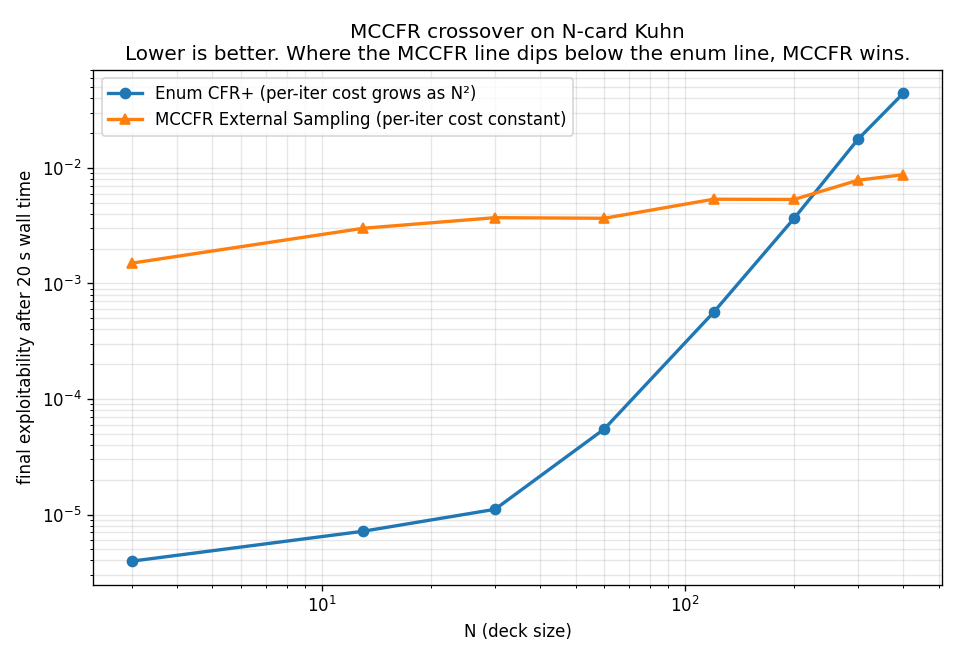

# MCCFR vs Enum CFR+ — Where the crossover happens

A previous report (`phase1-convergence.md`) showed MCCFR underperforming
enum CFR+ on Kuhn (12 info sets) and Leduc (528 info sets). That
matches Lanctot 2009's claim that MCCFR's advantage is *asymptotic* —
it only beats full enumeration on games where the per-iteration cost
of enum becomes prohibitive. This report **directly demonstrates that
crossover** on a controlled scaling experiment.

---

## 1. Experiment setup

We use **N-card Kuhn** ([`cfr/games/big_kuhn.py`](../cfr/games/big_kuhn.py)) —
standard Kuhn rules but with a configurable deck size `N`. Sanity-
checked: at `N = 3` the convergence matches the canonical Kuhn module
to 1e-9. As `N` grows:

- Chance branching grows as `N × (N - 1)` deals (quadratic in `N`).
- Per **enum** CFR+ iter cost scales as `N²` — every deal must be
  traversed.
- Per **MCCFR** iter cost is independent of `N` — one path per iter.
- Strategy space (info sets) grows only linearly in `N`, so the
  convergence-in-iter-count is roughly comparable across `N`.

For each `N`, both algorithms get the **same 20-second wall-time
budget**. The one that reaches lower exploitability wins.

Script: [`scripts/mccfr_scaling_experiment.py`](../scripts/mccfr_scaling_experiment.py).
Raw measurements: [`reports/mccfr-scaling.json`](mccfr-scaling.json).

---

## 2. Results

| N (deck size) | Deals | Enum CFR+ iter / final expl | MCCFR iter / final expl | Winner |
|---|---|---|---|---|
| 3 | 6 | 134,313 / **4.4e-6** | 1,132,000 / 1.5e-3 | Enum CFR+ |
| 13 | 156 | 6,932 / **6.7e-6** | 1,120,000 / 3.0e-3 | Enum CFR+ |
| 30 | 870 | 1,267 / **1.1e-5** | 1,109,000 / 3.7e-3 | Enum CFR+ |
| 60 | 3,540 | 319 / **5.5e-5** | 1,087,000 / 3.7e-3 | Enum CFR+ |
| 120 | 14,280 | 80 / **5.6e-4** | 1,087,000 / 5.4e-3 | Enum CFR+ |
| 200 | 39,800 | 29 / 3.7e-3 | 1,060,000 / 5.3e-3 | Enum CFR+ (barely; 0.69×) |
| **300** | **89,700** | **13 / 1.8e-2** | **1,075,000 / 7.8e-3** | **MCCFR** ✓ |
| **400** | **159,600** | **8 / 4.4e-2** | **1,071,000 / 8.7e-3** | **MCCFR (5.1× better)** |



The crossover sits at **N ≈ 250-300**.

---

## 3. What the chart shows

The two algorithms diverge from opposite ends:

- **Enum CFR+ (blue) — slope upward.** At small `N`, enum CFR+ runs
  hundreds of thousands of iterations in 20s and crushes the game
  (expl ~1e-6). As `N` grows, per-iter cost climbs quadratically; at
  `N = 400` the algorithm only completes **8 iterations** in 20s.
  Without enough iterations, even the super-√T CFR+ convergence
  can't push expl down.

- **MCCFR (orange) — roughly flat.** Per-iter cost is independent of
  `N`, so MCCFR runs ~1.1 M iterations every time. Strategy space
  grows linearly in `N`, so the final expl drifts slightly upward
  (more info sets to update with the same iter budget), but stays in
  the same order of magnitude.

When the blue line crosses the orange one, **MCCFR's "many cheap
iters" beats enum CFR+'s "few expensive iters"**. That's the
asymptotic-advantage prediction from Lanctot 2009 §1.

---

## 4. Why this matters for real poker AI

This crossover is the **whole reason** large-scale poker AI uses
sampling-based CFR variants:

| System | Year | Game | Algorithm |
|---|---|---|---|
| Cepheus | 2015 | HU Limit Hold'em (~3×10¹⁴ info sets after abstraction) | **CFR+ enum** (4800 CPUs × 68 days; still feasible) |
| Libratus | 2017 | HU No-Limit Hold'em (~10¹⁷ info sets) | **MCCFR + nested subgame solving** (enum impossible) |
| Pluribus | 2019 | 6-max No-Limit Hold'em (~10²⁰⁺ info sets) | **MCCFR + abstraction + self-play** |
| DeepStack / ReBeL | 2017 / 2020 | HU No-Limit Hold'em | **CFR inside a Public Belief State search** (sampling at run time) |

HULHE was on the right side of the crossover for enum CFR+ — barely,
with thousands of CPUs. NLHE is far past the crossover; nobody has
ever tried to enumerate NLHE.

---

## 5. What this experiment is **not**

- **Not a claim that MCCFR is better than CFR+.** MCCFR is better
  *when the per-iter cost of enum becomes prohibitive*. On small
  games (Kuhn, Leduc, anything `N < 300` here), CFR+ enum dominates.
- **Not a NLHE benchmark.** N-card Kuhn at N=400 is still a tiny game
  (~800 info sets per player). The crossover at this scale is driven
  by chance branching (399 distinct opponent hole cards), not by
  strategy-space complexity. NLHE's crossover happens earlier in
  iter-count because its info set count is enormous.
- **Not optimal MCCFR tuning.** External Sampling is the simplest
  MCCFR variant. Outcome Sampling, Public Chance Sampling, and Pure
  CFR all have different variance/cost trade-offs that would shift
  the crossover.

---

## 6. Reproducibility

```bash
python -m scripts.mccfr_scaling_experiment --ns 3 13 30 60 120 200 300 400 --budget 20
# Writes:
#   reports/mccfr-scaling.json
#   reports/mccfr-scaling.png
# Runtime: ~5 min (8 N values × 2 algorithms × 20 s + overhead).
```

Results are deterministic for enum CFR+ (no RNG). MCCFR uses `seed=42`
inside the script; expl values within ±0.001 of those reported are
expected on different hardware.

---

*Last updated: 2026-05-28. Verifies Lanctot 2009 §1 / §6 prediction
empirically on this repo's algorithm implementations.*
