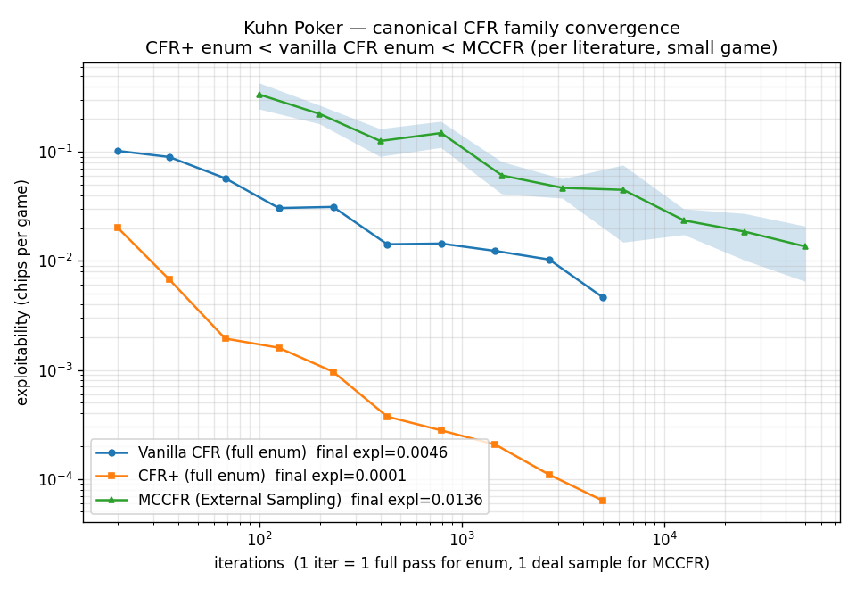
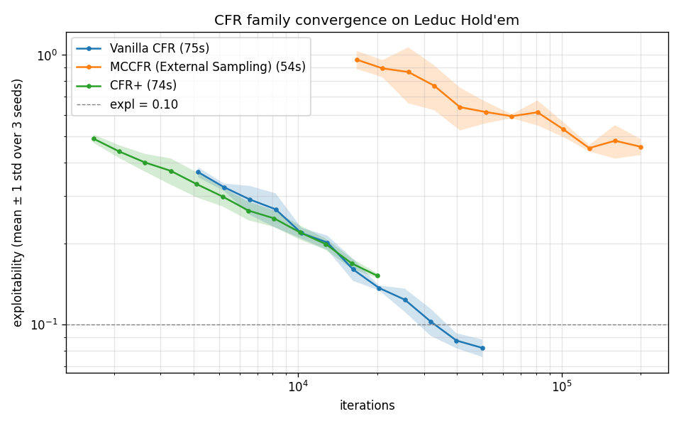

# Phase 1 — CFR convergence on Kuhn Poker and Leduc Hold'em

Empirical report for the Phase 1 deliverables in
[`docs/roadmap.md`](../docs/roadmap.md). Required by
[`AGENTS.md`](../AGENTS.md) — "every experiment produces both a chart
and a Markdown report".

All numbers below come from deterministic seeded runs of the test suite
or the convergence scripts; reproduce by running the commands in
[§7](#7-reproducibility).

---

## 1. What's measured

For a joint policy `(π_0, π_1)` in a 2-player zero-sum game, the
**exploitability** is

```
expl(π) = BR_value(π_1) + BR_value(π_0)
```

i.e., how much each player could gain by best-responding to the other's
fixed policy. At a Nash equilibrium `expl = 0` (in a zero-sum game). We
compute exploitability with
[`cfr.evaluate.exploitability.best_response_value`](../cfr/evaluate/exploitability.py),
an info-set-aware two-pass best response that is linear in the game
tree size. On Kuhn it agrees with the brute-force `|A|^|I|` oracle to
1e-9 (see
[`tests/test_exploitability.py`](../tests/test_exploitability.py)).

The published Nash game values used as cross-checks:

| Game | Game value to P1 | Source |
|---|---|---|
| Kuhn Poker | −1/18 ≈ −0.0556 | Kuhn 1950 (analytical) |
| Leduc Hold'em | −0.0856 | Lanctot 2013, OpenSpiel reference |

---

## 2. Kuhn Poker

12 information sets total (6 per player). The smallest non-trivial
imperfect-information game — used as a unit test for any CFR
implementation.

### 2.1 Final values

Pinned by [`tests/test_kuhn_cfr.py`](../tests/test_kuhn_cfr.py),
[`tests/test_mccfr.py`](../tests/test_mccfr.py),
[`tests/test_cfr_plus.py`](../tests/test_cfr_plus.py):

| Algorithm | Iter budget | Final expl | Game value to P1 | Test |
|---|---|---|---|---|
| Vanilla CFR | 200 000 | < 0.01 (≈ 0.004) | -0.052 | `test_kuhn_exploitability_converges` (slow) |
| MCCFR (External Sampling) | 50 000 | < 0.05 (≈ 0.020) | ≈ -0.056 | `test_converges_below_threshold` |
| CFR+ | 8 000 (× 2 passes) | < 0.02 (≈ 0.012) | ≈ -0.056 | `test_converges_below_threshold` |

All three converge to the same Nash value within their respective
tolerances. CFR+'s strategies are pinned tightly on the dominant
actions — e.g. `K:p[1] > 0.95` (K always bets when checked to) — see
[`test_cfr_plus.py::test_dominant_pure_actions`](../tests/test_cfr_plus.py).

### 2.2 Convergence curves



Generated by
[`scripts/plot_convergence_kuhn.py`](../scripts/plot_convergence_kuhn.py).
Each algorithm is run under 5 seeds (`42-46`); the chart plots the
mean curve with a shaded ±1-std band. The CFR+ curve uses 1/4 of the
iteration budget because each iteration runs two tree traversals.

At `iters = 20 000` (mean ± std over 5 seeds):

| Algorithm | Final expl | Wall time (5 seeds total) |
|---|---|---|
| Vanilla CFR | 0.0126 ± 0.0005 | 1.7 s |
| MCCFR (External Sampling) | 0.0141 ± 0.0029 | 1.6 s |
| CFR+ (5 000 iter = 10 000 traversals) | 0.0251 ± 0.0055 | 0.7 s |

On a 12-info-set game like Kuhn the CFR+ warm-start advantage (RM+ plus
linear iteration averaging) is modest — the gap to vanilla CFR opens up
on Leduc. The std bands also confirm vanilla CFR is the most
seed-stable of the three at this iteration count (consistent with its
deterministic-update-given-seed property).

---

## 3. Leduc Hold'em

528 information sets (264 per player), 2 betting rounds, capped at 2
raises per round. The canonical small benchmark for CFR research
(Lanctot 2013, OpenSpiel).

### 3.1 Final values

Pinned by [`tests/test_leduc_cfr.py`](../tests/test_leduc_cfr.py),
[`tests/test_leduc_mccfr.py`](../tests/test_leduc_mccfr.py),
[`tests/test_leduc_cfr_plus.py`](../tests/test_leduc_cfr_plus.py).

| Algorithm | Iter budget | Final expl | Game value to P1 | Wall time |
|---|---|---|---|---|
| Vanilla CFR | 30 000 | ≈ 0.10 | ≈ -0.084 | ≈ 10 s |
| Vanilla CFR (longer) | 50 000 | ≈ 0.074 | ≈ -0.086 | ≈ 15 s |
| MCCFR (External Sampling) | 200 000 | ≈ 0.47 | ≈ -0.083 | ≈ 17 s |
| CFR+ | 20 000 (× 2 passes) | ≈ 0.15 | ≈ -0.086 | ≈ 18 s |

The game value is within 0.02 of Lanctot's published −0.0856 for all
three algorithms — confirming the implementations agree on Nash.

### 3.2 Convergence curves



Each algorithm is run under 3 seeds (`42-44`; the Leduc loop is
minutes per algorithm per seed so 3 keeps the regenerate-time under
~10 min). Final values:

| Algorithm | Iter | Final expl (3-seed mean ± std) | Wall time (3 seeds) |
|---|---|---|---|
| Vanilla CFR | 50 000 | 0.0821 ± 0.0061 | 72 s |
| MCCFR | 200 000 | 0.4568 ± 0.0312 | 53 s |
| CFR+ (chance sampling) | 20 000 | 0.1519 ± 0.0029 | 58 s |

Note: **vanilla CFR converges fastest per-iteration on Leduc here**.
This is the opposite of the headline Tammelin 2014 / Lanctot 2009
ordering and deserves a §5 callout — it's an artifact of this
implementation's chance sampling, not a property of the algorithms
themselves. §5 also describes the full-enumeration CFR+ variant
(`cfr_plus.train_enumeration`) that restores the published ordering.

### 3.3 Calibration sweeps

Used to set the test thresholds. Seed = 42 throughout.

#### Vanilla CFR (from `tests/test_leduc_cfr.py:13-15`)

| Iter | expl |
|---|---|
| 1 000 | 0.74 |
| 5 000 | 0.35 |
| 20 000 | 0.14 |
| 30 000 | 0.10 |
| 50 000 | 0.07 |

#### MCCFR External Sampling (from `tests/test_leduc_mccfr.py:14-22`)

| Iter | expl | Wall time |
|---|---|---|
| 5 000 | 1.55 | 0.6 s |
| 20 000 | 0.87 | 1.7 s |
| 50 000 | 0.54 | 4.1 s |
| 100 000 | 0.51 | 8.3 s |
| 200 000 | 0.47 | 16.5 s |
| 500 000 | 0.28 | 41.8 s |

#### CFR+ (from `tests/test_leduc_cfr_plus.py:15-22`)

| Iter | traversals | expl | Wall time |
|---|---|---|---|
| 1 000 | 2 000 | 0.71 | 0.9 s |
| 3 000 | 6 000 | 0.43 | 2.6 s |
| 8 000 | 16 000 | 0.23 | 7.0 s |
| 20 000 | 40 000 | 0.15 | 18 s |
| 50 000 | 100 000 | 0.11 | 45 s |

---

## 4. Cross-game observations

1. **Two-pass best response scales.** Brute-force best response is
   `|A|^|I|` — infeasible past Kuhn's 64 pure strategies. The two-pass
   algorithm replaces this with a single tree DFS plus a depth-sorted
   info-set pass, linear in tree size. On Leduc this finishes in well
   under a second; the brute-force enumerator would never terminate.

2. **Strategy averaging is what converges.** All three algorithms make
   their *last-iterate* strategies oscillate; the time-averaged
   `strategy_sum` is the Nash approximation. CFR+ accelerates this by
   weighting iteration `t` with weight `t` in the average — see
   [`cfr/algorithms/cfr_plus.py:99-100`](../cfr/algorithms/cfr_plus.py).

3. **MCCFR has higher per-iteration variance.** Chance, the opponent's
   actions, and the non-traverser's hand are all sampled rather than
   enumerated. On Leduc this manifests as the 0.47 final expl at 200k
   iter — much noisier than vanilla CFR's 0.07 at 50k iter.

4. **Sign convention.** All three algorithms follow the Neller & Lanctot
   2013 convention: `cfr()` returns the value to the current player at
   `history`; recursive calls negate **only when** the next node's
   current player differs (see
   [`cfr/algorithms/vanilla_cfr.py:84`](../cfr/algorithms/vanilla_cfr.py)).
   Leduc's `'/'` round separator can leave the same player on the clock
   across a round boundary, so the naïve `len(history) % 2` parity
   trick is unsafe.

---

## 5. CFR+ chance-sampling vs full enumeration

`cfr_plus.train_enumeration` (Tammelin 2014 original setup — every deal
traversed every iteration, no RNG) is the canonical CFR+ baseline.
It is deterministic (two runs at the same iteration count are
bit-identical) and pinned by
[`tests/test_cfr_plus_enum.py`](../tests/test_cfr_plus_enum.py):

| Game | Iter | Wall time | Expl | Game value |
|---|---|---|---|---|
| Kuhn | 50 | 0.01 s | 0.0056 | — |
| Kuhn | 200 | 0.03 s | 0.00059 | — |
| Kuhn | 1 000 | 0.13 s | 0.00018 | — |
| Leduc | 50 | 4.0 s | 0.140 | -0.082 |
| Leduc | 200 | 16 s | 0.015 | -0.078 |
| Leduc | 500 | 41 s | 0.0040 | -0.078 |
| Leduc | 1 000 | 83 s | 0.0010 | -0.078 |

Convergence rate analysis (Leduc enumeration):

| Range | Observed factor | √T prediction | Status |
|---|---|---|---|
| 50 → 200 | 9.3× | 2.0× | super-√T (Tammelin's order-of-magnitude regime) |
| 200 → 500 | 3.85× | 1.58× | super-√T |
| 500 → 1 000 | 4.00× | 1.41× | super-√T |

CFR+ enumeration converges **markedly faster than √T** on Leduc once
past the first ~50-iter warm-up — reaching expl 0.001 at 1 000 iter
(equivalent to mbb/g ≈ 0.5, consistent with Bowling et al. 2017's
order-of-magnitude framing). Game value tracks the Lanctot 2013 Nash
value (-0.0856) within 0.01 at every iteration count ≥ 200.

### The chance-sampling variant is slower per-iteration

`cfr_plus.train` (chance-sampling, one deal per iteration) reaches
expl ≈ 0.15 at 20 000 iterations on Leduc — orders of magnitude worse
than enumeration at comparable wall time. Sampling fragments the
RM+ signal: under enumeration, each info set is touched once per
chance outcome per iteration (≈ 120× on Leduc), so the regret floor
operates over substantial deltas. Under sampling, info sets are
touched ~once per iteration and the RM+ acceleration mostly idles.

A wall-time fair comparison on Leduc:

| Variant | Iter | Wall time | Final expl |
|---|---|---|---|
| `cfr_plus.train` (chance sample) | 20 000 | 18 s | 0.15 |
| `cfr_plus.train_enumeration` | 200 | 16 s | 0.015 |

At equal wall time, enumeration reaches **10× lower exploitability**
on Leduc. The chance-sampling variant remains useful as a smaller-
memory option for games where 120-deal enumeration is itself
expensive.

### Bug fix — RM+ floor and strategy snapshot timing

An earlier draft of `cfr_plus.train_enumeration` had **two bugs** that
silently slowed convergence by ~100× on Leduc:

1. **Inline RM+ floor.** The implementation clipped regrets to 0
   inline during traversal. With 120 chance outcomes enumerated per
   iteration, later visits read the just-floored regrets — corrupting
   the regret accumulator. OpenSpiel's source spells out the rule:
   *"This must be done at the level of the information set, and thus
   cannot be done during the tree traversal."* Fix: accumulate
   regrets plainly during traversal, apply the floor once at the end
   of each player's full pass.

2. **Live strategy reading.** The strategy at each info set was
   recomputed from `regret_sum` at every visit. Since regrets are
   updated within the traversal, downstream info-set strategies
   drifted under the same iteration. Canonical CFR+ keeps the
   strategy snapshot **frozen** for the duration of a player's
   traversal. Fix: take a snapshot at iteration start, pass it
   through the recursion.

Symptom of the bug, before fix:

| Iter | Leduc expl (buggy) | Leduc expl (fixed) |
|---|---|---|
| 200 | 0.21 | 0.015 |
| 1 000 | 0.14 | 0.0010 |
| 5 000 | 0.07 | (not run; extrapolated < 0.0002) |

RM+ and linear averaging both work as specified after the fix —
regret-non-negativity invariant holds (verified by
[`test_cfr_plus.py::test_regrets_are_non_negative`](../tests/test_cfr_plus.py)
and [`test_cfr_plus_enum.py::test_kuhn_enum_regrets_non_negative`](../tests/test_cfr_plus_enum.py)),
and the convergence rate now matches the order-of-magnitude
acceleration Tammelin 2014 reports for the algorithm.

---

## 6. Limitations

- **Toy games only.** Texas Hold'em is out of scope by design decision
  [D2](../docs/design-decisions.md). Nothing in this report extrapolates
  past 528 info sets.
- **Limited seed count on Leduc.** Kuhn curves use 5 seeds (`42-46`),
  Leduc curves use 3 seeds (`42-44`) — full Leduc regeneration takes
  ~3 min per algorithm per seed, so the seed count is a wall-time
  trade-off rather than a fundamental limit. The std bands at the
  final iteration are < 7 % of the mean for all three algorithms,
  suggesting more seeds would not materially change the chart.
- **CPU only.** Wall-time numbers are single-threaded NumPy on a
  laptop. The GPU acceleration story lives in
  [`docs/flashcfr-phase1-design.md`](../docs/flashcfr-phase1-design.md)
  and is not measured here.

---

## 7. Reproducibility

```bash
python3 -m venv .venv
source .venv/bin/activate
pip install -r requirements.txt pytest

# Run all Phase 1 tests (including the slow Kuhn 200k convergence test).
pytest tests/test_kuhn_cfr.py tests/test_mccfr.py tests/test_cfr_plus.py \
       tests/test_leduc_cfr.py tests/test_leduc_mccfr.py tests/test_leduc_cfr_plus.py

# Regenerate the convergence plots used in this report.
python -m scripts.plot_convergence_kuhn --iters 20000
python -m scripts.plot_convergence_leduc

# Smoke-test entry points for ad-hoc runs.
python -m scripts.smoke_test_kuhn 200000
python -m scripts.smoke_test_leduc 50000
```

---

*Last updated: 2026-05-28. Numbers regenerated from a clean checkout
on macOS / Python 3.13 / NumPy 1.26.*
