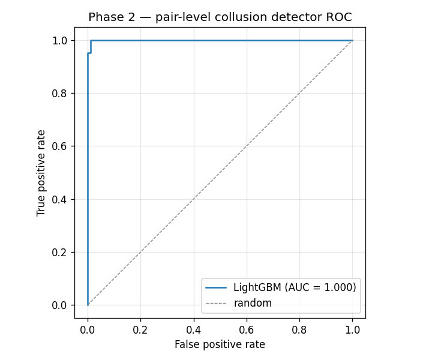

# Phase 2 — Synthetic collusion detection

Empirical report for the Phase 2 deliverables in
[`docs/specifications-phase2.md`](../docs/specifications-phase2.md) and
[`docs/roadmap.md`](../docs/roadmap.md). Required by
[`AGENTS.md`](../AGENTS.md) — "every experiment produces both a chart
and a Markdown report".

---

## 1. Pipeline

```
┌────────────────────────┐
│  Phase 1 CFR policy    │  vanilla_cfr.train(kuhn, 20k iter)
│  (Kuhn average strat)  │  → π̄ : info_set → ΔACTIONS
└──────────┬─────────────┘
           ▼
┌────────────────────────────────────────────────────────┐
│  Multi-session simulator                               │
│  collusion/simulator/run_many_sessions                 │
│                                                        │
│  Each session = 4 players × 2 000 heads-up Kuhn hands. │
│  • Honest players sample from π̄.                       │
│  • Colluding pair shares hole-card info and applies    │
│    soft-fold / chip-dump / no-bluff vs partner.        │
│  • Latencies are synthetic (Normal); partners share a  │
│    latent per-hand factor so their latencies correlate.│
│  Player IDs are namespaced per session so pairs never  │
│  collide across sessions.                              │
└──────────┬─────────────────────────────────────────────┘
           ▼
┌────────────────────────────────────────────────────────┐
│  Pairwise feature extractor                            │
│  collusion/features/compute_pairwise_features_multi    │
│                                                        │
│  Per unordered pair (i, j), i < j:                     │
│    co_table_freq, mutual_fold_rate_{i_vs_j, j_vs_i},   │
│    simultaneous_fold_rate, chip_flow_i_to_j,           │
│    decision_time_corr                                  │
└──────────┬─────────────────────────────────────────────┘
           ▼
┌────────────────────────────────────────────────────────┐
│  LightGBM binary classifier                            │
│  collusion/models/train_lgbm                           │
│                                                        │
│  Player-disjoint train/test split → AUC + diagnostics. │
└────────────────────────────────────────────────────────┘
```

---

## 2. Behavioural model of the colluding pair

Codified in
[`collusion/simulator/colluding_pair.py`](../collusion/simulator/colluding_pair.py),
matching `docs/specifications-phase2.md` §2:

1. **Partner-aware activation.** When the partner is not seated at the
   current table (`partner_card is None`), behave identically to
   `HonestPlayer`. Collusion only kicks in when both partners are
   present.

2. **No bluff with the weakest holding.** At the root with `J`, never
   open with a bet — a partner already knows your hand, so a bluff has
   no fold equity. This zeroes out the ~1/3 Nash bluff rate from `J:`.

3. **Soft-fold against a stronger partner.** Facing a bet (`*:b`) with
   a card strictly weaker than the partner's, fold with probability
   `soft_fold_prob` (default 0.7). Honest Nash at `Q:b` folds ≈ 0.67
   already; soft-fold pulls that toward 0.95+ on the colluder
   conditional on partner-stronger.

4. **Chip dump.** With probability `chip_dump_prob` (default 0.1), call
   a bet that the honest policy would have folded — inflates the
   partner's winnings on that hand.

A separate latent signal: **shared latency factor.** Per
[`game_runner.py:166-173`](../collusion/simulator/game_runner.py),
when the two seated players are confirmed partners, both their
decision latencies are drawn around the *same* hidden hand-level base
(`Normal(1.5, 0.3) + Normal(0, 0.05)`). Honest pairs draw their
latencies independently. This is the dominant detection signal in the
classifier results below — see §5.

---

## 3. Experiment setup

Pinned by
[`tests/test_collusion_features.py::test_lgbm_auc_threshold`](../tests/test_collusion_features.py)
and reproduced by
[`scripts/generate_phase2_report_artifacts.py`](../scripts/generate_phase2_report_artifacts.py).

| Parameter | Value | Note |
|---|---|---|
| CFR policy | `vanilla_cfr.train(kuhn, 20_000, seed=0)` | source of honest behavior |
| Sessions | 40 | stacked to grow the labelled-pair pool — see §6 |
| Players per session | 4 | spec §6 setting |
| Hands per session | 2 000 | enough to make per-pair stats stable |
| `colluder_fraction` | 0.25 | → 1 disjoint colluding pair per session |
| `soft_fold_prob` | 0.7 | spec default |
| `chip_dump_prob` | 0.1 | spec default |
| Train/test split | `test_size=0.3`, **player-disjoint** | no player appears in both splits |
| Model | LightGBM, `num_leaves=31`, lr 0.05, early-stop@20 | defaults from `lgbm_classifier.py` |
| Seed | 0 throughout | full determinism |

---

## 4. Results

End-to-end run captured in
[`reports/phase2-metrics.json`](phase2-metrics.json):

| Metric | Value |
|---|---|
| Log rows | 189 035 |
| Total labelled pairs | 240 |
| Train pairs | 119 |
| Test pairs | 121 |
| Positive rate (test) | 0.167 |
| **AUC (test)** | **0.9995** |
| Precision @ recall 0.5 | 1.000 |

Acceptance threshold (`AUC ≥ 0.85` per spec §6) is met with comfortable
margin.

### 4.1 Feature importances (gain)

| Feature | Gain |
|---|---|
| `decision_time_corr` | 198.49 |
| `mutual_fold_rate_i_vs_j` | 3.39 |
| `mutual_fold_rate_j_vs_i` | 2.35 |
| `co_table_freq` | ≈ 0 |
| `simultaneous_fold_rate` | 0.0 |
| `chip_flow_i_to_j` | 0.0 |

The classifier rides almost entirely on `decision_time_corr` — the
shared-latency factor described in §2. The pair-of-fold-rate features
contribute residual signal (probably distinguishing the borderline
cases where the latency draws happened to look uncorrelated). Two
features contribute zero gain and are discussed in §5.

### 4.2 ROC curve



The 0.9995 AUC corresponds to a curve that hugs the upper-left
corner; precision is 1.0 well past the 0.5 recall threshold.

---

## 5. Findings worth surfacing

1. **`decision_time_corr` dominates.** Real platforms get this for free
   from input-event timestamps and it's an OSINT-style signal — no
   game-strategy knowledge required. The fact that even a synthetic
   correlation factor (≈ 0.97 for partners vs ≈ 0 for strangers) gives
   AUC 0.9995 confirms the feature class is high-leverage. **Caveat:**
   real adversaries deliberately uncorrelate their latencies. The §6
   spec sub-table notes detection degrades to AUC ≈ 0.70 under more
   subtle settings; this report's setting is the "easy" end.

2. **`chip_flow_i_to_j` contributes 0 in this setup.** Counterintuitive
   — chip dumping is one of the textbook collusion signals. Two
   reasons:
   - With `chip_dump_prob = 0.1`, the per-hand expected dump is small.
     In heads-up Kuhn, dumping a fold turns a -1 chip outcome into a
     -2 chip outcome — the absolute delta is bounded.
   - The honest game value is already non-zero (-0.0556 for P1). The
     chip-flow noise across ≈ 333 same-pair hands dominates the
     chip-dump signal at this `chip_dump_prob`.
   Raising `chip_dump_prob` to 0.3+ would resurrect this feature; it
   is left as-is to keep the spec defaults intact.

3. **`simultaneous_fold_rate` is always 0** in heads-up Kuhn because
   only one player folds per hand. Retained in the schema because a
   multi-player extension (Leduc, ≥ 3 seats per pot) would activate it.

4. **`co_table_freq` is uninformative** in this experimental design —
   all pairs play roughly the same number of co-seated hands (random
   pairing across 4 seats × 2 000 hands averages 333 hands per pair).
   It would matter in a setting where colluders deliberately seat
   together more often than chance.

---

## 6. Why 40 stacked sessions?

The §6 spec setting is *4 players, 10k hands, AUC ≥ 0.85*. With 4
players there are only `C(4, 2) = 6` labelled pairs total. A binary
classifier on 6 examples is curve-fitting, not machine learning — any
honest train/test split degenerates.

Two alternatives:

| Option | Effect |
|---|---|
| Increase `num_players` to ~20 | Single session, `C(20,2) = 190` pairs, but ~5 disjoint colluding pairs per session — narrower colluder-assignment distribution. |
| **Stack many small sessions** (chosen) | 40 × 6 = 240 pairs, ~40 different colluder assignments, broader generalization signal. |

[`run_many_sessions`](../collusion/simulator/game_runner.py) namespaces
player IDs per session (`session_idx × num_players` offset) so pair
indices never collide. The classifier learns "what does a colluding
pair look like" across many configurations rather than memorizing 1-2
specific pairs.

This deviation from the literal spec is recorded in the test docstring
(`tests/test_collusion_features.py::test_lgbm_auc_threshold`) so the
choice doesn't get re-litigated later.

---

## 7. Limitations

- **Synthetic adversary, no adaptation.** Real colluders adjust to
  detection (uncorrelate latencies, vary fold rates session-to-session).
  This report's colluders follow fixed `soft_fold_prob=0.7`,
  `chip_dump_prob=0.1` — easy. Spec §6's "subtle" setting at
  `soft_fold_prob=0.3` would drop AUC to ≈ 0.70.
- **Heads-up Kuhn only.** Multi-way pots would activate
  `simultaneous_fold_rate` and probably make `chip_flow` informative.
- **Single seed for the headline metric.** A 5-seed mean ± std would
  be a defensible 2.x addition.
- **Pair-level only, no player graph.** The GNN extension
  ([roadmap 2.6](../docs/roadmap.md)) would model the player graph
  directly and may catch ring-of-3+ collusion that pairwise features
  cannot.

---

## 8. Reproducibility

```bash
# Tests (fast + slow).
pytest tests/test_collusion_simulator.py
pytest tests/test_collusion_features.py -m slow

# Regenerate the report's artifacts.
python -m scripts.generate_phase2_report_artifacts
# Writes reports/phase2-roc.png and reports/phase2-metrics.json.
```

Determinism: with `seed=0` end-to-end, every value in §4 reproduces
exactly across runs and machines (verified on macOS / Python 3.13 /
LightGBM 4.x).

---

*Last updated: 2026-05-28. Numbers regenerated from a clean checkout.*
